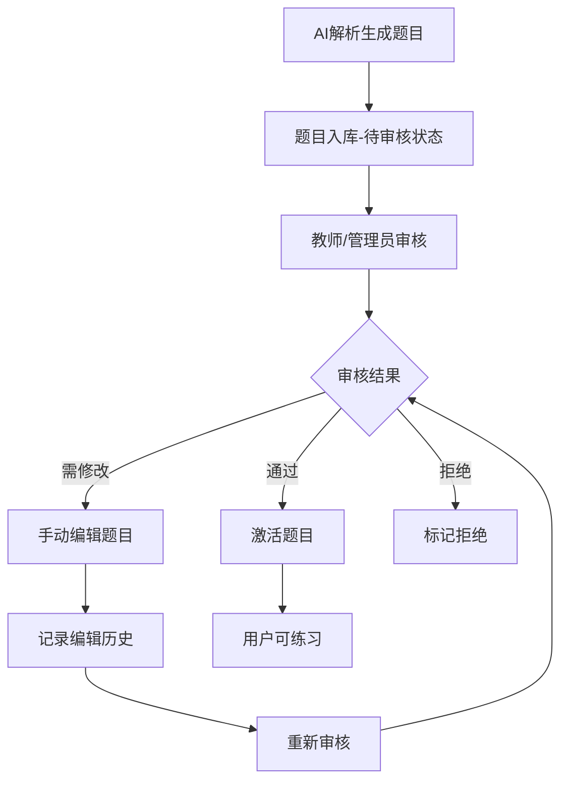

### 项目名称
浙江财经大学多专业智能考试系统

### 项目描述
基于Next.js全栈框架和MongoDB数据库开发的通用智能化考试练习系统，支持多专业多学科，集成浙江财经大学Agent平台AI能力进行试卷解析、错题分析和题目生成，支持企业微信部署。面向浙江财经大学师生，提供全方位的智能化教学辅助服务。

### 技术栈
- **前端框架**: Next.js 14 (App Router)
- **后端**: Next.js API Routes
- **数据库**: MongoDB
- **UI框架**: Tailwind CSS + shadcn/ui
- **AI服务**: 浙江财经大学Agent平台 (智能化教学辅助平台)
- **部署平台**: 企业微信 + 自建服务器
- **用户规模**: 30个并发用户（小规模部署）

## 功能架构设计

### 1. 系统架构图

```
┌─────────────────┐    ┌─────────────────┐    ┌─────────────────┐
│   企业微信端     │    │   Web前端       │    │   管理后台       │
│   (移动自适应)   │    │   (响应式)      │    │   (教师/管理员)  │
└─────────────────┘    └─────────────────┘    └─────────────────┘
          │                      │                      │
          └──────────────────────┼──────────────────────┘
                                 │
          ┌─────────────────────────────────────────────┐
          │              Next.js API层                   │
          │  ┌─────────────┐  ┌─────────────────────────┐│
          │  │ 用户认证API │  │  浙财Agent平台API       ││
          │  └─────────────┘  │  ┌─────────────────────┐││
          │  ┌─────────────┐  │  │ 试卷解析 Agent     │││
          │  │ 题目管理API │  │  └─────────────────────┘││
          │  └─────────────┘  │  ┌─────────────────────┐││
          │  ┌─────────────┐  │  │ 错题分析 Agent     │││
          │  │ 练习考试API │  │  └─────────────────────┘││
          │  └─────────────┘  │  ┌─────────────────────┐││
          │  ┌─────────────┐  │  │ 题目生成 Agent     │││
          │  │ 学科管理API │  │  └─────────────────────┘││
          │  └─────────────┘  └─────────────────────────┘│
          └─────────────────────────────────────────────┘
                                 │
          ┌─────────────────────────────────────────────┐
          │              MongoDB数据库                  │
          │  ┌─────────────┐  ┌─────────────────────────┐│
          │  │ 用户集合    │  │     题库集合             ││
          │  └─────────────┘  └─────────────────────────┘│
          │  ┌─────────────┐  ┌─────────────────────────┐│
          │  │ 练习记录    │  │     错题集合             ││
          │  └─────────────┘  └─────────────────────────┘│
          │  ┌─────────────┐  ┌─────────────────────────┐│
          │  │ 学科集合    │  │     知识点集合           ││
          │  └─────────────┘  └─────────────────────────┘│
          └─────────────────────────────────────────────┘
```

### 2. 核心功能模块

#### 2.1 用户练习模块
- **真题练习**: 历年真题练习（支持多专业多学科）
- **专项练习**: 按照题型联系
- **模拟考试**: 完整模拟考试流程
- **练习记录**: 用户练习历史和成绩统计
- **多学科支持**: 同一用户可学习多个专业

#### 2.2 AI解析模块
- **文档解析**: 支持PDF、Word、图片格式试卷解析
- **题目结构化**: 自动识别题型、题干、选项、答案
- **知识点标注**: 自动标注题目对应的学科知识点
- **多学科适配**: 根据不同学科特点进行解析

#### 2.3 错题分析模块
- **错题收集**: 自动收集用户错题
- **错误分析**: AI分析错误原因和知识点薄弱环节
- **个性化建议**: 提供针对不同学科的学习建议
- **学习路径**: 基于知识点关联性推荐学习顺序


（第二期生成）
#### 2.4 智能题目生成模块
- **相似题生成**: 基于错题生成相似练习题
- **难度调节**: 根据用户水平调整题目难度
- **知识点覆盖**: 确保生成题目覆盖相关知识点
- **学科适配**: 根据不同学科特点生成合适题目


## 架构决策和用户权限设计

### 项目架构决策

**推荐方案：单体架构（前后台统一项目）**

基于以下考虑，建议采用单体架构：

1. **用户规模小**: 30个并发用户，单体架构完全能够满足性能需求
2. **开发效率**: 前后台在同一项目中，开发、部署、维护更简单
3. **成本控制**: 减少服务器资源和运维复杂度
4. **快速迭代**: 便于需求变更和功能调整

**项目结构设计：**
```
智能考试系统/
├── app/
│   ├── (student)/          # 学生端页面
│   │   ├── subjects/       # 学科选择
│   │   ├── practice/       # 练习功能
│   │   │   ├── [subjectId]/ # 特定学科练习
│   │   │   └── history/    # 练习历史
│   │   ├── wrong-questions/ # 错题本
│   │   └── profile/        # 个人中心
│   ├── (teacher)/          # 教师端页面  
│   │   ├── question-review/ # 题目审核
│   │   ├── paper-upload/   # 试卷上传
│   │   └── student-progress/ # 学生进度
│   ├── (admin)/            # 管理员端页面
│   │   ├── user-management/ # 用户管理
│   │   ├── subject-management/ # 学科管理
│   │   ├── question-bank/   # 题库管理
│   │   └── system-settings/ # 系统设置
│   └── api/                # 统一API接口
│       ├── auth/           # 认证相关API
│       ├── subjects/       # 学科相关API
│       ├── questions/      # 题目相关API
│       ├── practice/       # 练习相关API
│       ├── ai/             # AI服务API
│       └── users/          # 用户管理API
├── components/
│   ├── student/            # 学生端组件
│   ├── teacher/            # 教师端组件
│   ├── admin/              # 管理端组件
│   └── shared/             # 共享组件
└── lib/
    ├── auth/               # 权限控制
    ├── rbac/               # 角色访问控制
    ├── zjcf-agent/         # 浙江财经大学Agent平台集成
    ├── database/           # 数据库连接
    └── utils/              # 通用工具
```

### 用户角色权限设计

#### 角色定义
1. **学生 (student)**: 练习和学习功能
2. **教师 (teacher)**: 教学管理和学生指导
3. **管理员 (admin)**: 系统管理和内容管理

#### 权限矩阵

| 功能模块 | 学生 | 教师 | 管理员 |
|---------|------|------|--------|
| 练习题目 | ✅ | ✅ | ✅ |
| 查看个人错题分析 | ✅ | ✅ | ✅ |
| 查看学生练习进度 | ❌ | ✅ | ✅ |
| 管理班级学生 | ❌ | ✅ | ✅ |
| 审核AI生成题目 | ❌ | ✅ | ✅ |
| 手动编辑题目 | ❌ | ✅ | ✅ |
| 上传试卷解析 | ❌ | ✅ | ✅ |
| 用户管理 | ❌ | ❌ | ✅ |
| 系统配置 | ❌ | ❌ | ✅ |
| AI服务配置 | ❌ | ❌ | ✅ |

#### 权限控制实现
```typescript
// lib/rbac/permissions.ts
export const PERMISSIONS = {
  // 学生权限
  PRACTICE_QUESTIONS: 'practice:questions',
  VIEW_OWN_ANALYSIS: 'analysis:view:own',
  
  // 教师权限
  VIEW_STUDENT_PROGRESS: 'student:progress:view',
  MANAGE_CLASS: 'class:manage',
  REVIEW_QUESTIONS: 'questions:review',
  EDIT_QUESTIONS: 'questions:edit',
  UPLOAD_PAPERS: 'papers:upload',
  
  // 管理员权限
  MANAGE_USERS: 'users:manage',
  SYSTEM_CONFIG: 'system:config',
  AI_CONFIG: 'ai:config',
} as const;

export const ROLE_PERMISSIONS = {
  student: [
    PERMISSIONS.PRACTICE_QUESTIONS,
    PERMISSIONS.VIEW_OWN_ANALYSIS,
  ],
  teacher: [
    PERMISSIONS.PRACTICE_QUESTIONS,
    PERMISSIONS.VIEW_OWN_ANALYSIS,
    PERMISSIONS.VIEW_STUDENT_PROGRESS,
    PERMISSIONS.MANAGE_CLASS,
    PERMISSIONS.REVIEW_QUESTIONS,
    PERMISSIONS.EDIT_QUESTIONS,
    PERMISSIONS.UPLOAD_PAPERS,
  ],
  admin: Object.values(PERMISSIONS),
};
```

#### 路由保护中间件
```typescript
// middleware.ts
export function middleware(request: NextRequest) {
  const { pathname } = request.nextUrl;
  
  // 角色基础路由保护
  if (pathname.startsWith('/admin')) {
    return requireRole(['admin']);
  }
  
  if (pathname.startsWith('/teacher')) {
    return requireRole(['teacher', 'admin']);
  }
  
  if (pathname.startsWith('/student')) {
    return requireRole(['student', 'teacher', 'admin']);
  }
  
  // API权限控制
  if (pathname.startsWith('/api')) {
    return checkAPIPermission(request);
  }
}
```

## 数据库设计

### 1. 用户集合 (users)
```javascript
{
  _id: ObjectId,
  openid: String, // 企业微信用户标识
  nickname: String,
  avatar: String,
  role: String, // 用户角色: 'student', 'teacher', 'admin'
  // 企业微信扩展信息（待客户提供API格式）
  extendedInfo: {
    grade: String, // 年级
    major: String, // 专业
    department: String, // 部门
    studentId: String, // 学号/工号
  },
  // 学习相关信息
  subjects: [{ // 学习的专业/科目
    subjectId: String, // 科目ID (如 "hsk", "cet4", "math", "programming")
    subjectName: String, // 科目名称
    level: String, // 当前等级/水平
    targetLevel: String, // 目标等级
    isActive: Boolean // 是否正在学习
  }],
  primarySubject: String, // 主要学习科目
  registerTime: Date,
  lastLoginTime: Date,
  totalPracticeTime: Number, // 总练习时长(分钟)
  practiceCount: Number, // 练习次数
  accuracy: Number, // 总体正确率
  weakKnowledgePoints: [String], // 薄弱知识点
  // 权限相关
  permissions: [String], // 权限列表
  isActive: Boolean, // 账号状态
  createdBy: ObjectId, // 创建者(管理员)
  lastUpdated: Date
}
```

### 2. 题库集合 (questions)
```javascript
{
  _id: ObjectId,
  questionId: String, // 题目唯一标识
  type: String, // 题型: 'single_choice', 'multiple_choice', 'fill_blank', 'comprehensive', 'listening_choice', 'listening_reading', 'essay', 'calculation'
  // 学科信息
  subject: {
    subjectId: String, // 学科ID (如 "hsk", "cet4", "math", "programming")
    subjectName: String, // 学科名称
    level: String, // 难度等级/年级 (如 "HSK4", "大学英语四级", "高等数学上")
    chapter: String, // 章节 (如 "第三章 函数")
    section: String // 小节 (如 "3.1 函数的概念")
  },
  difficulty: Number, // 难度等级(1-5)
  category: String, // 题目分类 (根据学科而定，如语言类: '词汇', '语法', '阅读'；理科: '计算', '证明', '应用')
  knowledgePoints: [String], // 知识点标签
  content: {
    stem: String, // 题干
    options: [String], // 选项(选择题)
    blanks: [String], // 填空(填空题)
    audio: String, // 音频URL(听力题)
    images: [String], // 图片URL
    materials: String // 阅读材料(阅读题)
  },
  answer: {
    correct: [String], // 正确答案
    explanation: String, // 答案解析
    keyPoints: [String] // 关键知识点
  },
  statistics: {
    attemptCount: Number, // 被练习次数
    correctCount: Number, // 正确次数
    accuracy: Number // 正确率
  },
  source: String, // 题目来源: 'real_exam', 'practice', 'ai_generated'
  sourceExam: String, // 来源考试(如2023年6月HSK4级)
  createTime: Date,
  updateTime: Date,
  aiGenerated: Boolean, // 是否AI生成
  parentQuestionId: String, // 基于哪道题生成(AI生成题目)
  // 题目审核和编辑相关
  reviewStatus: String, // 审核状态: 'pending', 'approved', 'rejected', 'modified'
  reviewedBy: ObjectId, // 审核人员ID
  reviewTime: Date, // 审核时间
  reviewComments: String, // 审核意见
  editHistory: [{ // 编辑历史
    editedBy: ObjectId,
    editTime: Date,
    changes: Object, // 修改内容
    reason: String // 修改原因
  }],
  isActive: Boolean, // 是否激活使用
  qualityScore: Number // 题目质量评分(0-100)
}
```

### 3. 练习记录集合 (practice_records)
```javascript
{
  _id: ObjectId,
  userId: ObjectId,
  sessionId: String, // 练习会话ID
  practiceType: String, // 'real_exam', 'knowledge_practice', 'mock_exam', 'chapter_practice'
  subject: {
    subjectId: String, // 学科ID
    subjectName: String, // 学科名称
    level: String // 练习的等级/年级
  },
  knowledgePoint: String, // 专项练习的知识点
  questions: [{
    questionId: ObjectId,
    userAnswer: [String],
    correctAnswer: [String],
    isCorrect: Boolean,
    timeSpent: Number, // 答题用时(秒)
    submitTime: Date
  }],
  startTime: Date,
  endTime: Date,
  totalTime: Number, // 总用时(分钟)
  score: Number, // 得分
  accuracy: Number, // 正确率
  completionStatus: String // 'completed', 'interrupted'
}
```

### 4. 错题集合 (wrong_questions)
```javascript
{
  _id: ObjectId,
  userId: ObjectId,
  questionId: ObjectId,
  userAnswer: [String],
  correctAnswer: [String],
  wrongCount: Number, // 错误次数
  lastWrongTime: Date,
  firstWrongTime: Date,
  aiAnalysis: {
    errorType: String, // 错误类型
    weaknessArea: String, // 薄弱领域
    suggestion: String, // AI建议
    analysisTime: Date
  },
  mastered: Boolean, // 是否已掌握
  masteredTime: Date,
  generatedQuestions: [ObjectId] // 基于此错题生成的练习题
}
```

### 5. 学科集合 (subjects)
```javascript
{
  _id: ObjectId,
  subjectId: String, // 学科唯一标识 (如 "hsk", "cet4", "math_advanced", "programming_java")
  name: String, // 学科名称 (如 "HSK中文考试", "大学英语四级", "高等数学", "Java编程")
  category: String, // 学科类别 (如 "语言类", "理工类", "文史类", "技能类")
  description: String, // 学科描述
  levels: [{ // 等级/年级定义
    levelId: String, // 等级ID (如 "hsk1", "hsk2", "beginner", "intermediate")
    levelName: String, // 等级名称
    description: String, // 等级描述
    order: Number // 排序
  }],
  categories: [String], // 题目分类列表 (如语言类: ["词汇", "语法", "阅读"]；理科: ["计算", "证明", "应用"])
  questionTypes: [String], // 支持的题型
  isActive: Boolean, // 是否启用
  createdBy: ObjectId, // 创建者
  createTime: Date,
  updateTime: Date,
  // 统计信息
  statistics: {
    totalQuestions: Number, // 总题目数
    totalUsers: Number, // 学习用户数
    avgAccuracy: Number // 平均正确率
  }
}
```

### 6. 知识点库集合 (knowledge_points)
```javascript
{
  _id: ObjectId,
  pointId: String, // 知识点ID
  name: String, // 知识点名称
  subject: {
    subjectId: String, // 学科ID
    subjectName: String, // 学科名称
    level: String // 适用等级/年级
  },
  category: String, // 分类 (根据学科而定)
  parentPoint: String, // 父级知识点
  description: String, // 知识点描述
  examples: [String], // 例句/例子/公式
  difficulty: Number, // 难度等级
  importance: Number, // 重要程度
  relatedPoints: [String], // 相关知识点
  questionCount: Number, // 相关题目数量
  prerequisites: [String], // 前置知识点
  followUps: [String], // 后续知识点
  tags: [String], // 标签 (如 "基础", "重点", "难点")
  userStatistics: [{
    userId: ObjectId,
    masteryLevel: Number, // 掌握程度(0-100)
    practiceCount: Number,
    accuracy: Number,
    lastPracticeTime: Date
  }]
}
```

## AI Agent设计

### 浙江财经大学Agent平台集成方案

基于浙江财经大学Agent平台，我们将采用以下集成策略：

#### 浙财Agent平台集成架构
```typescript
// lib/ai/zjcf-agent-client.ts
export class ZJCFAgentClient {
  private apiKey: string;
  private baseURL: string;
  
  constructor(apiKey: string, baseURL: string = 'http://localhost:3000') {
    this.apiKey = apiKey;
    this.baseURL = baseURL;
  }
  
  async callAgent(agentId: string, messages: any[], variables?: Record<string, any>) {
    const response = await fetch(`${this.baseURL}/api/v1/chat/completions`, {
      method: 'POST',
      headers: {
        'Authorization': `Bearer ${this.apiKey}`,
        'Content-Type': 'application/json',
      },
      body: JSON.stringify({
        chatId: `chat_${Date.now()}`,
        stream: false,
        detail: false,
        variables: variables || {},
        messages: messages
      })
    });
    
    return response.json();
  }
  
  async parseDocument(documentUrl: string, examInfo: any) {
    return this.callAgent('paper-parse-agent', [
      {
        role: 'user',
        content: `请解析以下试卷文档：${documentUrl}`
      }
    ], {
      document_url: documentUrl,
      subject_id: examInfo.subjectId,
      subject_name: examInfo.subjectName,
      exam_name: examInfo.examName
    });
  }
  
  async analyzeWrongQuestions(userId: string, wrongQuestions: any[], subject: any) {
    return this.callAgent('error-analysis-agent', [
      {
        role: 'user',
        content: '请分析用户的错题情况并提供学习建议'
      }
    ], {
      user_id: userId,
      wrong_questions: JSON.stringify(wrongQuestions),
      subject_id: subject.subjectId,
      subject_name: subject.subjectName
    });
  }
  
  async generateQuestions(baseQuestion: any, requirements: any) {
    return this.callAgent('question-generation-agent', [
      {
        role: 'user',
        content: '请基于用户错题生成相似的练习题目'
      }
    ], {
      base_question: JSON.stringify(baseQuestion),
      subject_id: requirements.subjectId,
      difficulty: requirements.difficulty,
      count: requirements.count
    });
  }
}
```

### 1. 试卷解析Agent

#### 提示词设计
```
你是一个专业的考试题目解析专家，能够处理多种专业和学科的考试试卷。请仔细分析上传的试卷文档，将其中的题目结构化输出。

**当前解析任务：**
- 学科: {{subject_name}}
- 学科ID: {{subject_id}}
- 考试名称: {{exam_name}}

**解析要求：**
1. 识别题目类型：单选题、多选题、填空题、综合题、听力选择题、听力阅读题、计算题、论述题等
2. 提取题目结构：题干、选项、正确答案
3. 标注知识点：根据题目内容和所属学科判断涉及的知识点
4. 判断难度等级：基于当前学科的标准评估题目难度(1-5级)
5. 确定题目分类：根据学科特点分类（如语言类：词汇、语法、阅读；理科：计算、证明、应用）
6. 提供答案解析：简明扼要地解释正确答案

**输出格式：**
请严格按照以下JSON格式输出，不要包含任何其他内容：

{
  "questions": [
    {
      "questionId": "题目唯一标识",
      "type": "题型(single_choice/multiple_choice/fill_blank/comprehensive/listening_choice/listening_reading/essay/calculation)",
      "subject": {
        "subjectId": "{{subject_id}}",
        "subjectName": "{{subject_name}}",
        "level": "等级/年级",
        "chapter": "章节",
        "section": "小节"
      },
      "difficulty": "难度等级(1-5)",
      "category": "题目分类(根据学科而定)",
      "knowledgePoints": ["知识点1", "知识点2"],
      "content": {
        "stem": "题干内容",
        "options": ["选项A", "选项B", "选项C", "选项D"], // 选择题必填
        "blanks": ["空格1答案", "空格2答案"], // 填空题必填
        "materials": "阅读材料内容", // 阅读题选填
        "audio": "音频文件描述", // 听力题选填
        "images": ["图片描述1", "图片描述2"], // 有图片时填写
        "formulas": ["公式1", "公式2"] // 理科题目的公式
      },
      "answer": {
        "correct": ["正确答案"],
        "explanation": "答案解析",
        "keyPoints": ["关键知识点1", "关键知识点2"],
        "steps": ["解题步骤1", "解题步骤2"] // 理科题目的解题步骤
      }
    }
  ],
  "metadata": {
    "examName": "{{exam_name}}",
    "examDate": "考试日期",
    "subjectId": "{{subject_id}}",
    "subjectName": "{{subject_name}}",
    "totalQuestions": "题目总数",
    "analysisTime": "解析时间戳"
  }
}

请开始解析文档中的题目。
```

#### API接口设计
```typescript
// POST /api/ai/parse-paper
interface ParsePaperRequest {
  documentUrl: string;  // 文档URL
  documentType: 'pdf' | 'word' | 'image';
  examInfo: {
    name: string;        // 考试名称
    date: string;        // 考试日期
    subjectId: string;   // 学科ID
    subjectName: string; // 学科名称
    level?: string;      // 难度等级/年级
    chapter?: string;    // 章节
  };
}

interface ParsePaperResponse {
  success: boolean;
  data: {
    questions: Question[];
    metadata: ExamMetadata;
  };
  error?: string;
}

// GET /api/subjects - 获取支持的学科列表
interface SubjectsResponse {
  success: boolean;
  data: {
    subjects: Subject[];
  };
}

// POST /api/subjects - 创建新学科（管理员）
interface CreateSubjectRequest {
  subjectId: string;
  name: string;
  category: string;
  description: string;
  levels: SubjectLevel[];
  categories: string[];
  questionTypes: string[];
}
```

### 2. 错题分析Agent

#### 提示词设计
```
你是一个专业的学习分析师，能够针对不同专业和学科提供个性化的学习分析建议。请分析用户的错题情况，提供针对性的学习建议。

**当前分析任务：**
- 学科: {{subject_name}}
- 学科ID: {{subject_id}}
- 用户ID: {{user_id}}

**分析维度：**
1. 错误类型分析：概念混淆、粗心大意、知识盲区、理解偏差、方法错误、计算错误等
2. 知识点薄弱分析：识别用户在当前学科的哪些知识点上存在问题
3. 学习建议：根据学科特点提供针对性的学习方法和练习建议
4. 难度调节：建议下次练习的难度等级
5. 学习路径：根据知识点关联性推荐学习顺序

**用户错题数据：**
- 错题信息：{{wrong_questions}}
- 学科信息：{{subject_id}} - {{subject_name}}
- 用户学习记录：从变量中获取

**学科特点考虑：**
- 语言类学科：注重词汇积累、语法理解、语感培养
- 理工类学科：注重概念理解、逻辑推理、计算准确性
- 文史类学科：注重知识记忆、理解分析、表达能力
- 技能类学科：注重实践操作、经验积累、技巧掌握

**输出要求：**
请按照以下JSON格式输出分析结果：

{
  "analysis": {
    "errorPattern": "错误模式分析",
    "weaknessAreas": ["薄弱领域1", "薄弱领域2"],
    "knowledgeGaps": ["知识盲区1", "知识盲区2"],
    "masteryLevel": "掌握程度评估(0-100)",
    "errorTypes": ["错误类型1", "错误类型2"],
    "subjectSpecificIssues": "学科特有问题分析"
  },
  "suggestions": {
    "studyPlan": "学习计划建议",
    "practiceMethod": "练习方法建议",
    "focusPoints": ["重点关注知识点1", "重点关注知识点2"],
    "difficultyAdjustment": "难度调节建议",
    "learningPath": ["学习路径步骤1", "学习路径步骤2"],
    "timeAllocation": "时间分配建议"
  },
  "generationHints": {
    "similarQuestionTypes": ["相似题型1", "题型2"],
    "knowledgePointsToFocus": ["知识点1", "知识点2"],
    "difficultyRange": [1, 3],
    "questionCount": 3
  }
}
```

#### API接口设计
```typescript
// POST /api/ai/analyze-wrong-questions
interface AnalyzeWrongQuestionsRequest {
  userId: string;
  wrongQuestions: WrongQuestion[];
  userProfile: UserProfile;
  practiceHistory: PracticeRecord[];
}

interface AnalyzeWrongQuestionsResponse {
  success: boolean;
  data: {
    analysis: ErrorAnalysis;
    suggestions: StudySuggestions;
    generationHints: QuestionGenerationHints;
  };
  error?: string;
}
```

### 3. 题目生成Agent

#### 提示词设计
```
你是一个专业的题目生成专家，能够为不同专业和学科生成高质量的练习题目。请基于用户的错题情况和薄弱知识点，生成相似的练习题目。

**当前生成任务：**
- 学科: {{subject_name}}
- 学科ID: {{subject_id}}
- 目标难度: {{difficulty}}
- 生成数量: {{count}}

**生成要求：**
1. 保持与原题相同的题型和难度等级
2. 覆盖相同的知识点，但题目内容要有所变化
3. 确保生成的题目符合当前学科的标准和特点
4. 答案要准确，解析要清晰
5. 根据学科特点调整题目结构（如理科题目包含计算步骤，语言题目注重语感培养）

**参考信息：**
- 基础题目：{{base_question}}
- 学科信息：{{subject_id}} - {{subject_name}}
- 难度要求：{{difficulty}}
- 生成数量：{{count}}

**学科特点考虑：**
- 语言类：注重语境变化、词汇替换、语法结构
- 理工类：注重数值变化、条件调整、解题方法
- 文史类：注重背景材料、角度变化、分析深度
- 技能类：注重场景变化、操作步骤、实践应用

**输出格式：**
请严格按照以下JSON格式输出：

{
  "generatedQuestions": [
    {
      "questionId": "生成题目唯一标识",
      "type": "题型",
      "subject": {
        "subjectId": "{{subject_id}}",
        "subjectName": "{{subject_name}}",
        "level": "等级/年级",
        "chapter": "章节",
        "section": "小节"
      },
      "difficulty": "难度等级",
      "category": "题目分类",
      "knowledgePoints": ["知识点1", "知识点2"],
      "content": {
        "stem": "题干内容",
        "options": ["选项A", "选项B", "选项C", "选项D"],
        "blanks": ["空格答案"],
        "materials": "阅读材料",
        "formulas": ["公式1", "公式2"], // 理科题目
        "images": ["图片描述"] // 如需要
      },
      "answer": {
        "correct": ["正确答案"],
        "explanation": "详细解析",
        "keyPoints": ["关键知识点"],
        "steps": ["解题步骤1", "解题步骤2"] // 理科题目
      },
      "parentQuestionId": "基于的原题ID",
      "generationReason": "生成原因说明",
      "aiGenerated": true
    }
  ],
  "metadata": {
    "generationTime": "生成时间",
    "totalGenerated": "生成题目数量",
    "subjectId": "{{subject_id}}",
    "subjectName": "{{subject_name}}",
    "targetKnowledgePoints": ["目标知识点"],
    "difficultyLevel": "{{difficulty}}"
  }
}
```

#### API接口设计
```typescript
// POST /api/ai/generate-questions
interface GenerateQuestionsRequest {
  wrongQuestionId: string;
  userId: string;
  targetKnowledgePoints: string[];
  difficultyRange: [number, number];
  questionType: string;
  count: number; // 生成数量
}

interface GenerateQuestionsResponse {
  success: boolean;
  data: {
    generatedQuestions: Question[];
    metadata: GenerationMetadata;
  };
  error?: string;
}
```

## 核心功能设计

### 题目手动编辑功能

#### 编辑工作流


#### 编辑界面设计
```typescript
// 题目编辑器组件
interface QuestionEditorProps {
  question: Question;
  mode: 'review' | 'edit' | 'create';
  onSave: (question: Question) => void;
  onReject: (reason: string) => void;
}

// 编辑功能
const QuestionEditor: React.FC<QuestionEditorProps> = ({
  question,
  mode,
  onSave,
  onReject
}) => {
  return (
    <div className="question-editor">
      {/* 题目基本信息编辑 */}
      <QuestionBasicForm question={question} />
      
      {/* 内容编辑器 */}
      <QuestionContentEditor content={question.content} />
      
      {/* 答案和解析编辑 */}
      <AnswerExplanationEditor answer={question.answer} />
      
      {/* 知识点标注 */}
      <KnowledgePointSelector 
        points={question.knowledgePoints} 
        hskLevel={question.hskLevel} 
      />
      
      {/* 审核操作 */}
      {mode === 'review' && (
        <ReviewActions 
          onApprove={() => onSave(question)}
          onReject={onReject}
          onModify={() => setMode('edit')}
        />
      )}
    </div>
  );
};
```

### 企业微信身份信息集成

#### 模拟数据结构（待客户API）
```typescript
// 当前使用的模拟数据结构
interface MockUserExtendedInfo {
  grade: string; // 年级，如 "2023级"
  major: string; // 专业，如 "计算机科学与技术"
  department: string; // 院系，如 "计算机学院"
  studentId: string; // 学号，如 "2023001001"
  class: string; // 班级，如 "计科2301班"
}

// 模拟数据生成器（开发阶段使用）
export const generateMockUserInfo = (openid: string): MockUserExtendedInfo => {
  const grades = ['2021级', '2022级', '2023级', '2024级'];
  const majors = ['计算机科学与技术', '软件工程', '人工智能', '数据科学与大数据技术'];
  const departments = ['计算机学院', '软件学院', '信息学院'];
  
  return {
    grade: grades[Math.floor(Math.random() * grades.length)],
    major: majors[Math.floor(Math.random() * majors.length)],
    department: departments[Math.floor(Math.random() * departments.length)],
    studentId: `2023${String(Math.floor(Math.random() * 999999)).padStart(6, '0')}`,
    class: `${majors[0].slice(0, 2)}${grades[0].slice(0, 4)}01班`
  };
};

// 企业微信API适配器（待实现）
export class WeChatWorkAPIAdapter {
  async getUserExtendedInfo(openid: string): Promise<MockUserExtendedInfo | null> {
    // TODO: 实现真实的企业微信API调用
    // 当前返回模拟数据
    return generateMockUserInfo(openid);
  }
  
  // 预留客户API集成接口
  async fetchRealUserInfo(openid: string): Promise<any> {
    // 待客户提供API格式后实现
    throw new Error('Real API not implemented yet');
  }
}
```

## 技术实现方案

### 1. 核心功能模块实现

#### 用户练习模块
```typescript
// components/student/PracticeInterface.tsx
interface PracticeInterfaceProps {
  subjectId: string;
  questions: Question[];
  onSubmit: (answers: Answer[]) => void;
}

const PracticeInterface: React.FC<PracticeInterfaceProps> = ({
  subjectId,
  questions,
  onSubmit
}) => {
  // 练习界面实现
  // 支持多种题型：单选、多选、填空、综合等
  // 计时功能、自动保存、题目导航
};
```

#### AI集成模块
```typescript
// lib/zjcf-agent/client.ts
export class ZJCFAgentClient {
  async parseDocument(file: File, subjectInfo: SubjectInfo) {
    // 调用浙财Agent平台解析试卷
    const formData = new FormData();
    formData.append('file', file);
    formData.append('subject', JSON.stringify(subjectInfo));
    
    const response = await fetch('/api/ai/parse-paper', {
      method: 'POST',
      body: formData
    });
    
    return response.json();
  }

  async analyzeWrongQuestions(userId: string, wrongQuestions: WrongQuestion[]) {
    // 分析错题，生成学习建议
  }

  async generateSimilarQuestions(baseQuestion: Question, count: number) {
    // 基于错题生成相似练习题
  }
}
```

#### 题目管理模块
```typescript
// lib/database/questions.ts
export class QuestionManager {
  async createQuestion(questionData: QuestionInput): Promise<Question> {
    // 创建新题目
  }

  async updateQuestion(questionId: string, updates: Partial<Question>): Promise<Question> {
    // 更新题目信息
  }

  async getQuestionsBySubject(subjectId: string, filters?: QuestionFilter): Promise<Question[]> {
    // 按学科获取题目
  }

  async reviewQuestion(questionId: string, review: ReviewData): Promise<void> {
    // 审核题目
  }
}
```

### 2. 企业微信集成
```typescript
// lib/wechat/auth.ts
export class WeChatWorkAuth {
  async authenticate(code: string): Promise<UserSession> {
    // 企业微信OAuth认证
    const tokenResponse = await this.getAccessToken(code);
    const userInfo = await this.getUserInfo(tokenResponse.access_token);
    
    return {
      openid: userInfo.openid,
      nickname: userInfo.nickname,
      avatar: userInfo.avatar,
      extendedInfo: await this.getExtendedUserInfo(userInfo.openid)
    };
  }

  async getExtendedUserInfo(openid: string): Promise<ExtendedUserInfo> {
    // 获取年级、专业等扩展信息（模拟数据）
    return generateMockUserInfo(openid);
  }
}
```

### 3. 数据库索引优化
```javascript
// MongoDB索引配置
db.users.createIndex({ "openid": 1 }, { unique: true });
db.users.createIndex({ "role": 1, "isActive": 1 });

db.questions.createIndex({ "subject.subjectId": 1, "isActive": 1 });
db.questions.createIndex({ "knowledgePoints": 1, "difficulty": 1 });
db.questions.createIndex({ "reviewStatus": 1, "createTime": -1 });

db.practice_records.createIndex({ "userId": 1, "startTime": -1 });
db.practice_records.createIndex({ "subject.subjectId": 1, "completionStatus": 1 });

db.wrong_questions.createIndex({ "userId": 1, "mastered": 1 });
db.wrong_questions.createIndex({ "questionId": 1 });

db.subjects.createIndex({ "subjectId": 1 }, { unique: true });
db.subjects.createIndex({ "category": 1, "isActive": 1 });

db.knowledge_points.createIndex({ "subject.subjectId": 1, "category": 1 });
db.knowledge_points.createIndex({ "pointId": 1 }, { unique: true });
```

### 4. API路由设计
```typescript
// app/api/practice/[subjectId]/route.ts
export async function GET(
  request: Request,
  { params }: { params: { subjectId: string } }
) {
  const { searchParams } = new URL(request.url);
  const difficulty = searchParams.get('difficulty');
  const category = searchParams.get('category');
  
  // 获取指定学科的练习题目
  const questions = await QuestionManager.getQuestionsBySubject(
    params.subjectId,
    { difficulty, category }
  );
  
  return NextResponse.json({ questions });
}

// app/api/ai/analyze-wrong/route.ts
export async function POST(request: Request) {
  const { userId, wrongQuestions, subjectId } = await request.json();
  
  // 调用AI分析错题
  const analysis = await zjcfAgent.analyzeWrongQuestions(
    userId,
    wrongQuestions,
    { subjectId }
  );
  
  return NextResponse.json({ analysis });
}
```

### 5. 响应式设计
```css
/* 核心样式 - 移动端优先 */
.question-container {
  @apply w-full p-4 bg-white rounded-lg shadow-sm;
}

.question-options {
  @apply grid grid-cols-1 gap-2 mt-4;
}

/* 平板和桌面端适配 */
@media (min-width: 768px) {
  .question-container {
    @apply max-w-4xl mx-auto p-6;
  }
  
  .question-options {
    @apply grid-cols-2 gap-3;
  }
}

/* 企业微信特定样式 */
.wechat-work {
  --safe-area-inset-top: env(safe-area-inset-top);
  --safe-area-inset-bottom: env(safe-area-inset-bottom);
  
  padding-top: var(--safe-area-inset-top);
  padding-bottom: var(--safe-area-inset-bottom);
}
```


### 阶段一：基础架构搭建 (2周)
- [ ] Next.js项目初始化
- [ ] MongoDB数据库设计和搭建
- [ ] 多学科支持的数据模型设计
- [ ] 基础认证系统
- [ ] 企业微信集成
- [ ] 响应式UI框架搭建

### 阶段二：核心功能开发 (4周)
- [ ] 用户角色权限系统
- [ ] 学科管理系统
- [ ] 题库管理系统（支持多学科）
- [ ] 练习模块开发（学生端）
- [ ] 基础统计功能
- [ ] 企业微信身份信息集成（模拟数据）

### 阶段三：AI功能集成 (3周)
- [ ] 浙江财经大学Agent平台集成和配置
- [ ] 试卷解析Agent开发和调试
- [ ] 错题分析Agent开发和调试
- [ ] 题目生成Agent开发和调试
- [ ] 多学科AI模型适配
- [ ] 题目手动编辑功能

### 阶段四：管理端开发 (3周)
- [ ] 教师端功能开发
- [ ] 管理员端功能开发
- [ ] 题目审核工作流
- [ ] 学生进度管理
- [ ] 班级管理功能

### 阶段五：高级功能和优化 (2周)
- [ ] 个性化推荐系统
- [ ] 高级统计分析
- [ ] 性能优化
- [ ] 安全加固

### 阶段六：测试和部署 (2周)
- [ ] 功能测试
- [ ] 性能测试
- [ ] 安全测试
- [ ] 生产环境部署


## 项目总结与展望

### 项目核心价值
浙江财经大学智能考试系统不仅仅是一个简单的考试平台，而是一个**全方位的智能化教学生态系统**，将为浙财带来以下核心价值：

#### 🎯 **教育数字化转型标杆**
- 在浙江省高校中率先实现AI驱动的智能化教学
- 展示浙财在教育创新领域的前瞻性和领导力
- 为其他高校提供可复制的数字化转型范例

#### 📊 **数据驱动的教学革新**  
- 基于浙财Agent平台的深度学习分析
- 构建专属于浙财的教学知识图谱
- 实现从经验教学到数据驱动教学的转变

#### 🚀 **多专业全覆盖的智能平台**
- 支持经济学、管理学、法学、文学等多个学科
- 可扩展到浙财所有专业和课程
- 真正实现"一个平台，全校共享"

#### 💡 **持续进化的AI教学助手**
- 随着使用数据增加，系统智能化程度不断提升
- 个性化教学方案越来越精准
- 预测分析能力持续增强

